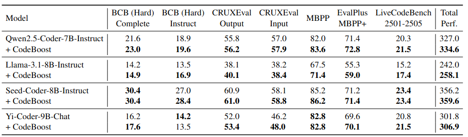

<div align="center">
  
</div>


# ⚡CodeBoost
CodeBoost: Boosting Code LLMs by Squeezing Knowledge from Code Snippets with RL

Code large language models (LLMs) have become indispensable tools for building efficient and automated coding pipelines. Existing models are typically post-trained using reinforcement learning (RL) from general-purpose LLMs using "human instruction-final answer" pairs, where the instructions are usually from manual annotations. However, collecting high-quality coding instructions is both labor-intensive and difficult to scale. On the other hand, code snippets are abundantly available from various sources. This imbalance presents a major bottleneck in instruction-based post-training. We propose CodeBoost, a post-training framework that enhances code LLMs purely from code snippets, without relying on human-annotated instructions. Extensive experiments across several code LLMs and benchmarks verify that CodeBoost consistently improves performance, demonstrating its effectiveness as a scalable and effective training pipeline. 

[[arxiv]](http://arxiv.org/abs/2508.05242)

<div align="center">
  
</div>


## 🛠️ Installation

System
```
ubuntu 22.04
python 3.10
cuda 12.4
```

Environment
```bash
git clone https://ghfast.top/https://github.com/sijieaaa/CodeBoost # If need proxy

export cb_dir=/path_to_CodeBoost # e.g. /home/user/CodeBoost
# Better to update ~/.bashrc
echo "export cb_dir=/path_to_CodeBoost" >> $HOME/.bashrc
source ~/.bashrc
```

#### 1. Install EasyR1
Our code is modified from [EasyR1](https://github.com/hiyouga/EasyR1). Thanks for the execellent work! We refer to the repo for more information.
```bash
cd $cb_dir/EasyR1
conda create -n easyr1 python=3.10 -y
conda activate easyr1

pip install torch==2.6.0 torchvision==0.21.0 torchaudio==2.6.0 --index-url https://download.pytorch.org/whl/cu124
pip install vllm==0.8.5
pip install ray==2.46.0
pip install uv
pip install https://ghfast.top/https://github.com/Dao-AILab/flash-attention/releases/download/v2.7.4.post1/flash_attn-2.7.4.post1+cu12torch2.6cxx11abiFALSE-cp310-cp310-linux_x86_64.whl # If need proxy
pip install libcst networkit networkx transformers==4.51.3 datasets==3.6.0 huggingface-hub==0.33.4 modelscope
pip install swanlab

pip install -e .
```
Login in `swanlab` and `huggingface`
```bash
swanlab login
huggingface-cli login 
# Type your keys/tokens
```


#### 2. Install OpenCoder
OpenCoder is used for code executing.
```bash
cd $cb_dir
git clone https://ghfast.top/https://github.com/sijieaaa/OpenCodeRunner # If need proxy
cd $cb_dir/OpenCodeRunner
pip install -e .
```


#### 3. Install Benchmarks
```bash
# BigCodeBench
cd $cb_dir/benchmark/bigcodebench
pip install -r Requirements/requirements-eval_pure.txt
uv pip install -e . --index-url https://pypi.tuna.tsinghua.edu.cn/simple
# LiveCodeBench
cd $cb_dir/benchmark/LiveCodeBench_v3
pip install -e . --index-url https://pypi.tuna.tsinghua.edu.cn/simple
# EvalPlus
cd $cb_dir/benchmark/evalplus
pip install -e . --index-url https://pypi.tuna.tsinghua.edu.cn/simple
# CRUXEval
cd $cb_dir/benchmark/cruxeval
pip install -r requirements.txt
# others
pip uninstall tree-sitter tree-sitter-python -y
pip install tree-sitter tree-sitter-python
```


## 🔥 Run
Download Datasets+LLM Weights
```bash
# LLM E.g. Qwen/Qwen2.5-Coder-3B-Instruct
huggingface-cli download  Qwen/Qwen2.5-Coder-3B-Instruct  --force-download
# Dataset
huggingface-cli download  sijieaaa/verl_prepare_datasets  --force-download  --repo-type dataset --local-dir ${cb_dir}/verl_prepare_datasets/datasets
```

#### 1. Train
The running bash script is in `EasyR1/examples/main.sh`.
You can change to use different LLMs, GPU numbers, and other configs. <br>
Default LLM is `Qwen2.5-Coder-3B-Instruct`, which does not pose much GPU burden. <br>
LLM weights and datasets will be automatically downloaded during training.
```bash
bash $cb_dir/EasyR1/examples/main.sh
```
During running, checkpoints will be stored in `EasyR1/ckpts`, specified by experiment names and global steps.

#### 2. Test
The testing bash script is in `EasyR1/eval.sh`. 
You need to change to your own experiment names and global steps.


## ⭐ Citation
```
```
